#  Auto Scaling Group with Application Load Balancer (ALB) in AWS

This guide explains how to set up an Auto Scaling Group (ASG) behind an Application Load Balancer (ALB) in AWS.
The ALB will distribute traffic across EC2 instances, and the ASG will automatically adjust the number of instances based on demand.

---

##  Architecture Overview

The system is designed to handle different types of user traffic (Home, Laptop, Mobile) via an **Application Load Balancer (ALB)**, which routes requests to appropriate **Target Groups**. 
Each target group is associated with an **Auto Scaling Group** that manages compute resources based on the nature of traffic.

---

##  Architecture  
   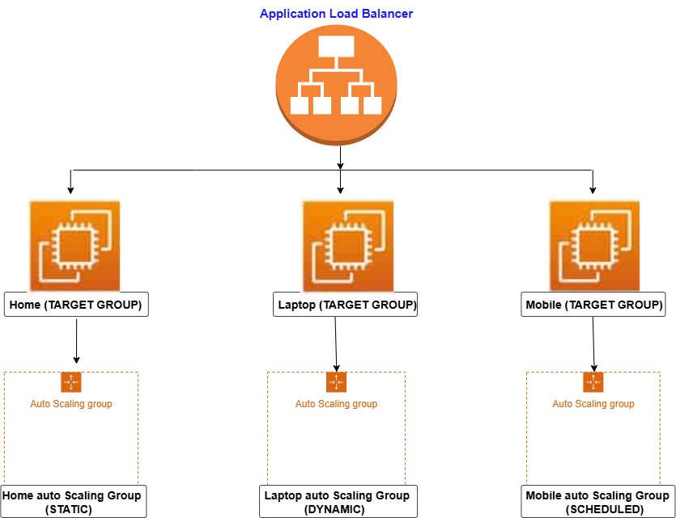

---

##  Architecture Overview

- **ALB** routes traffic to 3 target groups: **Home, Laptop, and Mobile.**
- Each target group is connected to an Auto Scaling Group (ASG).
- Each ASG uses a different type of scaling policy:
  - Home: Static
  - Laptop: Dynamic (based on CPU, etc.)
  - Mobile: Scheduled

---   

##  Prerequisites

- Before you start, ensure you have:

    1. An AWS account with admin access.
    2. AWS CLI installed and configured.
    3. Basic knowledge of EC2, VPC, and Security Groups.
---

#  Step-by-Step Implementation Guide
---

##  Step 1: Prepare EC2 Launch Template (for all ASGs)
   **1. Home Launch Template**

 1. Go to the EC2 Console → Launch Templates → Create launch template
 2. Fill in:
       - **Template Name**: Home-LT
       - **Description** : This is my Home instance
         
       - **AMI ID**: Use Amazon Linux 2 AMI
       - **Instance Type**: t3.micro
       - **Key Pair**: Select your existing key or create a new one
       - **Security Group**: Allow ports 22 (SSH) and 80 (HTTP)

 3. In Advanced Details → paste this User Data script:

         #!/bin/bash
          yum update -y
          yum install httpd -y
          systemctl start httpd
          systemctl enable httpd
          echo "<h1>Hello World from Home instance $(hostname -f)</h1>" > /var/www/html/index.html
       - 

 4. Leave all other settings as default unless you have specific requirements.
 5. Click Create launch template.

**2. Laptop Launch Template**
 1. Create new launch template → Name: Laptop-LT
 2. Use the same instance type, AMI, security group and key pair.
 3. In Advanced Details, paste this User Data script:

          #!/bin/bash
          yum update -y
          yum install httpd -y
          systemctl start httpd
          systemctl enable httpd
          mkdir -p /var/www/html/laptop/
          echo "<h1>Hello World from Laptop instance $(hostname -f)</h1>" > /var/www/html/laptop/index.html
 4. Click Create launch template

**3. Mobile Launch Template**
 1. Create new launch template → Name: Mobile-LT
 2. Same setup for AMI, instance type, security group and key pair.
 3. In Advanced Details, paste this User Data script:

          #!/bin/bash
          yum update -y
          yum install httpd -y
          systemctl start httpd
          systemctl enable httpd
          mkdir -p /var/www/html/mobile/
          echo "<h1>Hello World from Mobile instance $(hostname -f)</h1>" > /var/www/html/mobile/index.html

 4. lick Create launch template

- Launch templates are created succesfully :
   
---

## Step 2: Create Target Groups

1. Go to **EC2 Console** → **Target Groups** → **Create Target Group**.
2. Choose:
   - **Target type**: Instances
   - **Protocol**: HTTP
   - **Port**: 80
   - 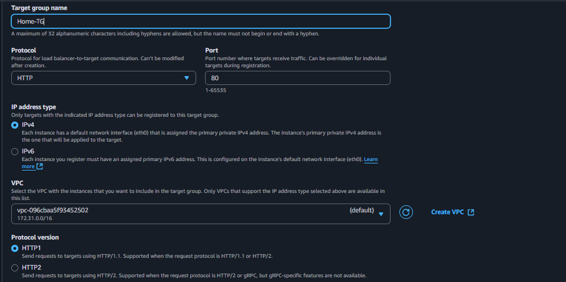
3. Name each target group:
   - **Home-TG**
   - **Laptop-TG**
   - **Mobile-TG**
4. Register EC2 instances (optional for now — ASGs will do this automatically).
5. Click **Create**.

  - **Do this **two times** — one for each (Laptop, Mobile).**
  - 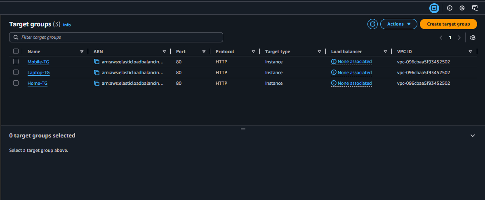
---

## Step 3: Create Auto Scaling Groups

Do this three times with different scaling types:

**Home Auto Scaling Group (STATIC)**

1. Go to **EC2 Console** → **Auto Scaling Groups** → **Create**.
2. Group Name: **Home-ASG**
3. Attach to Launch Template: **Home-LT**
        
 4. Choose VPC and Subnets.
        
4. Desired, Min, Max capacity: Set all to **2**  
     
5. Skip scaling policies (static)
6. Create ASG.

**Laptop Auto Scaling Group (DYNAMIC)**

1. Create ASG as above → Name: **Laptop-ASG**
2. Attach to Launch Template: **Laptop-LT**
3. Capacity:
   - Min: 2
   - Max: 7
   - Desired: 3
4. On **Scaling Policies** step:
   - Choose **Target tracking scaling policy**
   - Metric: Average CPU Utilization
   - Target Value: 50%
5. Create ASG.

**Mobile Auto Scaling Group (SCHEDULED)**

1. Create ASG → Name: **Mobile-ASG**
2. Attach to Launch Template: **Mobile-LT**
3. Capacity:
   - Min: 2
   - Max: 7
   - Desired: 3
4. On **Scaling Policies** step:
   - Choose **Target tracking scaling policy**
   - Metric: Average CPU Utilization
   - Target Value: 50%
5. Create ASG.
   
 #### - Review the ASG 
 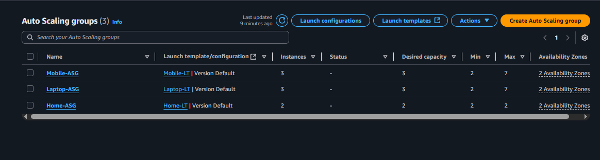

---
## Step 4: Make Mobile-ASG a Scheduled Action
 1. Go to Mobile-ASG → scroll down to Scheduled actions.
 2. Click Create scheduled action.
 3. Enter Name = **BigBillionSale**.
 4. Set the Capacity values:
      - Min = 5
      - Max = 15
      - Desired = 8
 5. In Recurrence, select **Cron** → enter: 
    - #### 0 10 21 10 *
   - (This means: Start at 10:00 AM, 21st October every year).
 6. Under End By, set the end date and time:
    - **Date: 2025/10/31**
    - **Time: 10:30**
    - 
 7. Click **Create**.
     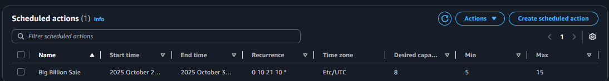
---

## Step 5: Attach Target Group to Auto Scaling Group  

1. Go to the **Auto Scaling Groups** section in the AWS Console.  
2. Select the **Mobile-ASG**.  
3. Click on **Actions** → **Edit**.  
4. In the **Load balancing** section, choose:  
   - **Application**, **Network**, or **Gateway** Load Balancer target groups (depending on your setup).  
5. Add the **Mobile-TG** to the Auto Scaling Group.  
        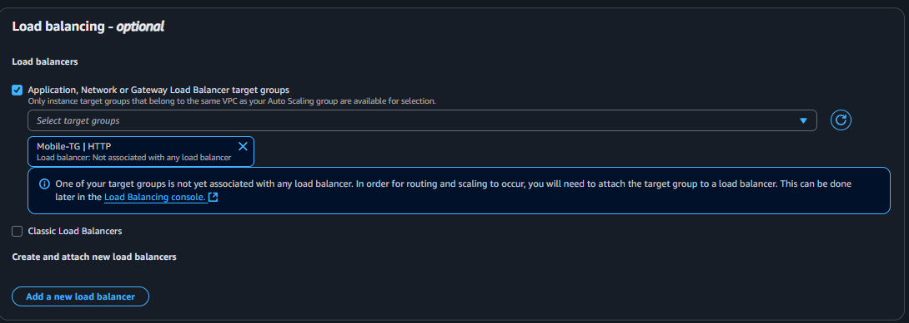
6. Click **Update** to save changes.  
   
 ####  -  Repeat the same process for the Home-ASG and Laptop-ASG so that each Auto Scaling Group is attached to its respective Target Group.  
---

## Step 6: Create Application Load Balancer (ALB)

1. Go to **EC2 Console** → **Load Balancers** → **Create Load Balancer**.
2. Choose **Application Load Balancer**.
        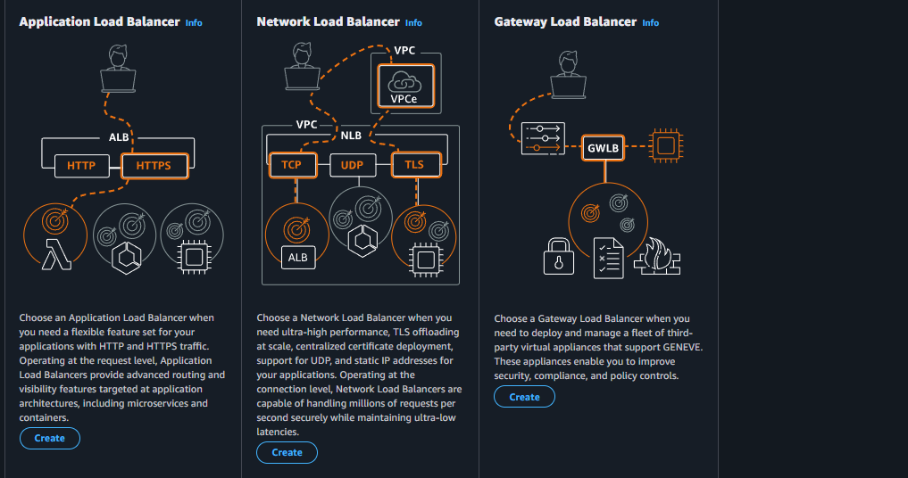
3. Provide:
   - **Name**: ALB  
   - **Scheme**: Internet-facing  
   - **IP address type**: IPv4  
4. Configure **listeners:**
   - **Protocol**: HTTP
   - **Port**: 80
5. In **Default action**, select **Forward to Target Groups** → choose **Home-TG**. 
   - 
6. Select at least **two public subnets**.
7. Configure **Security Group**:
     - Allow inbound **HTTP (80)** traffic. 
8. Leave **Target Groups** rules for later (do not configure at this step).
9. Click **Create**.

---

## Step 7: Configure ALB Listener Rules  

1. Go to the **Listeners** tab of the ALB.  
2. Click on the listener (**HTTP: 80**) → **View/Edit rules**.  
        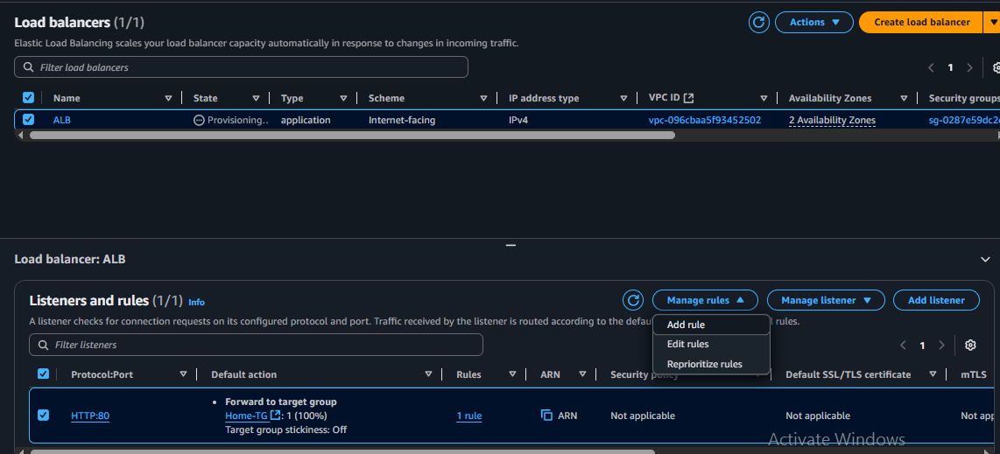
3. Add a new rule to route traffic:  
   - **Name/Tag**: mobile-rule  
   - **Condition**: Select **Path** → set path as /mobile/* 
  
   - **Action**: Forward to **Mobile-TG**  
  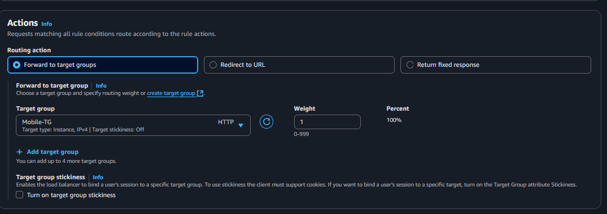
   - Click **Next**  
   - Set **Priority** = 1  
   - Click **Next** → **Add rule**  

1. Repeat the same process for the **Laptop-TG**:  
   - **Name/Tag**: laptop-rule  
   - **Condition**: Path = /laptop/*  
   - **Action**: Forward to **Laptop-TG**  
   - Assign the next available **Priority** (e.g., 2).  

2. Save the rules to apply changes.  
---

 ## Step 8: Test the ALB Setup  

1. Go to the **EC2 Console** → **Load Balancers**.  
2. Select your **Application Load Balancer (ALB)**.  
3. Copy the **DNS name** of the ALB (e.g., ALB-123456789.ap-south-1.elb.amazonaws.com).  
      
4. Open a browser and test the following paths:  
   - http://<ALB-DNS-Name> → should route to **Home-TG**.  
    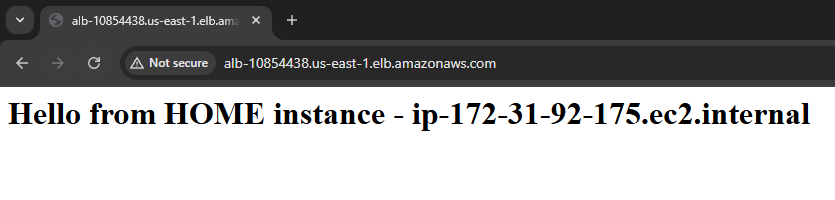
   - http://<ALB-DNS-Name>/mobile/ → should route to **Mobile-TG**.  
    
   - http://<ALB-DNS-Name>/laptop/ → should route to **Laptop-TG**.  
    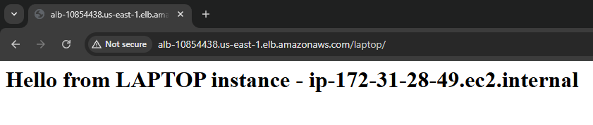
---

##  Conclusion  

In this project, we successfully set up an **Application Load Balancer (ALB)** integrated with **Auto Scaling Groups (ASGs)** and **Target Groups** in AWS.  

- We created **separate Target Groups** for Home, Mobile, and Laptop applications.  
- Configured **Auto Scaling Groups** to ensure high availability and automatic scaling during peak traffic (e.g., Big Billion Sale).  
- Deployed an **Application Load Balancer** with **listener rules** to route traffic based on URL paths (`/mobile/*`, `/laptop/*`, etc.).  
- Finally, we tested the configuration using the **ALB DNS name**, confirming that traffic is routed correctly and scaling works as expected.  

#### With this setup:  
- The application is **highly available**,  
- Can **scale automatically** during demand spikes,  
- And provides **efficient traffic distribution** across healthy EC2 instances.  

This project demonstrates a real-world implementation of **scalable, load-balanced architectures** in AWS that can be applied to e-commerce platforms, web applications, and enterprise solutions.  
  

 
